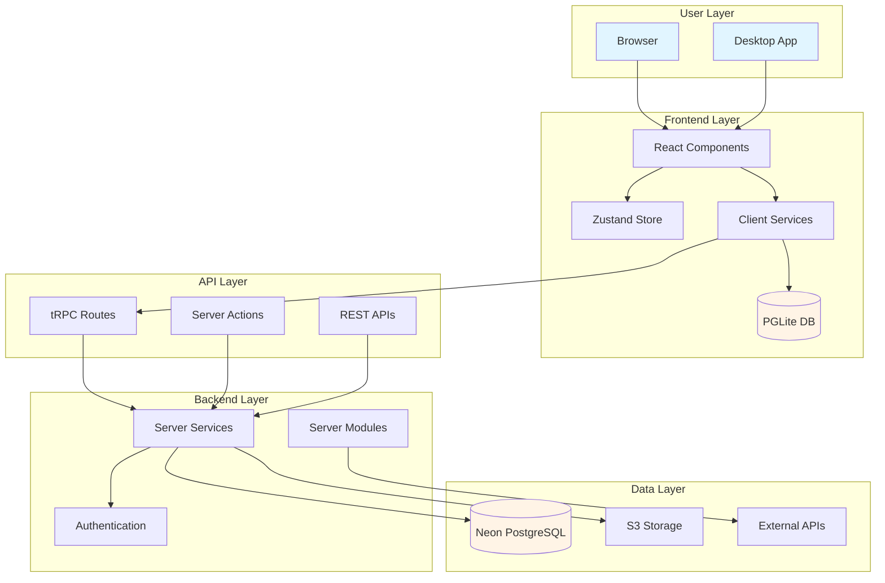

# Architecture Overview - Part 1 of 2

**Documented:** November 2025
**Tech Stack Research:** [TECH_STACK_RESEARCH.md](./TECH_STACK_RESEARCH.md)
**Target:** Mid-level developers proficient in JS/TS/React

**📄 This is Part 1 of 2** | **[Continue to Part 2 →](./ARCHITECTURE-OVERVIEW-PART-02.md)**

This document provides a high-level overview of LobeHub's architecture, explaining how all the pieces fit together.

**Prerequisites:**
- [Getting Started](./GETTING_STARTED.md) - Have the project running
- Basic understanding of React and web applications

**Time to read:** 25 minutes (Part 1)

---

## Table of Contents - Part 1

1. [The Big Picture](#the-big-picture)
2. [Architecture Principles](#architecture-principles)
3. [System Architecture](#system-architecture)
4. [Technology Stack Overview](#technology-stack-overview)
5. [Monorepo Structure](#monorepo-structure)
6. [Frontend Architecture](#frontend-architecture)
7. [Backend Architecture](#backend-architecture)
8. [Database Strategy](#database-strategy)
9. [Data Flow Patterns](#data-flow-patterns)
10. [Platform Variants](#platform-variants)

**[Part 2 →](./ARCHITECTURE-OVERVIEW-PART-02.md)** covers:
- Key Architectural Decisions
- Security & Performance
- Deployment Architecture
- Common Patterns
- Next Steps

---

## The Big Picture

### 🧠 Mental Model: Three-Tier Architecture with a Twist

```
┌─────────────────────────────────────────────────┐
│           FRONTEND (React 19)                   │
│  • Components (UI)                              │
│  • Client-side state (Zustand)                  │
│  • Client-side database (PGLite)                │
└─────────────────┬───────────────────────────────┘
                  │
                  │ tRPC / Server Actions
                  ↓
┌─────────────────────────────────────────────────┐
│           BACKEND (Next.js 16)                  │
│  • Server Components                            │
│  • tRPC API Routes                              │
│  • Server Services                              │
└─────────────────┬───────────────────────────────┘
                  │
                  │ Drizzle ORM
                  ↓
┌─────────────────────────────────────────────────┐
│           DATABASE                              │
│  • PGLite (WASM in browser) ← Client            │
│  • Neon PostgreSQL (cloud)  ← Server            │
└─────────────────────────────────────────────────┘
```

**🌉 Bridge from React:** Like a traditional React + REST API + Database app, but:
- Frontend can have its own database (PGLite)
- API calls are type-safe (tRPC)
- Server-side rendering is built-in (Next.js)

**💡 Aha Moment:** The frontend can work **completely offline** with PGLite, then sync to the cloud when online!

---

## Architecture Principles

### Core Principles (Nov 2025)

**1. Type Safety Everywhere**
- TypeScript throughout the entire stack
- tRPC provides end-to-end type safety (no manual API types)
- Drizzle ORM provides type-safe database queries

**2. Offline-First, Cloud-Optional**
- PGLite enables full offline functionality
- Progressive enhancement with cloud features
- Sync when available, work when not

**3. Monorepo for Shared Code**
- 19 workspace packages for modularity
- Shared types, utilities, and constants
- Single source of truth for business logic

**4. Modern React Patterns (2025)**
✅ React Server Components (render on server)
✅ Server Actions (server functions from client)
✅ Streaming and Suspense
✅ New hooks (useActionState, useFormStatus, useOptimistic)

**5. Performance First**
- Turbopack for fast builds
- React 19 compiler optimizations
- Edge runtime for low latency
- Streaming for faster page loads

---

## System Architecture

### High-Level Component Diagram



**🎯 Remember This:** "Client DB for speed, Server DB for sync"

---

## Technology Stack Overview

### Frontend Stack (Client-Side)

```typescript
// Component Layer
React 19.2.0
  ↓ renders with
Next.js 16.0.3 (App Router + Server Components)
  ↓ styled with
Ant Design 5.28 + antd-style 3.7 (UI + CSS-in-JS)
  ↓ state managed by
Zustand 5.0.4
  ↓ data fetched with
SWR 2.3.6 + TanStack Query 5.90
  ↓ local data stored in
PGLite 0.2.17 (PostgreSQL in WASM)
```

**🌉 Bridge from React:**
- React 19 = Your familiar React + Server Components
- Next.js 16 = Create React App + routing + SSR
- Ant Design = Material-UI alternative
- Zustand = Redux but simpler
- SWR = useEffect + fetch but better

---

### Backend Stack (Server-Side)

```typescript
// API Layer
Next.js 16 Server Components + Server Actions
  ↓ type-safe APIs with
tRPC 11.7.1
  ↓ authentication via
NextAuth 5.0-beta + Clerk
  ↓ business logic in
Server Services
  ↓ data access with
Drizzle ORM 0.44.7
  ↓ stored in
Neon PostgreSQL (serverless)
```

**🌉 Bridge from Express:**
- Next.js API routes = Express routes
- tRPC = REST API + automatic TypeScript types
- Server Services = Express middleware/controllers
- Drizzle ORM = Sequelize/TypeORM alternative

---

### Development Stack

```typescript
TypeScript 5.9.3 (type system)
  ↓ tested with
Vitest 3.2.4 (unit) + Playwright 1.56 (E2E)
  ↓ built with
Turbopack (Next.js 16 default bundler)
  ↓ packages managed by
pnpm 10.20.0 (monorepo + dependencies)
  ↓ scripts run with
Bun 1.3.1 (fast execution)
```

📚 **Detailed breakdown:** [TECH_STACK_GUIDE.md](./TECH_STACK_GUIDE.md)

---

## Monorepo Structure

### 🧠 Mental Model: One Repo, Many Packages

```
lobe-chat/                    ← Root monorepo
├── src/                      ← Main application
│   ├── app/                  ← Next.js App Router
│   ├── components/           ← React components
│   ├── services/             ← Client services
│   ├── server/               ← Server-only code
│   └── store/                ← Zustand stores
│
├── packages/                 ← Shared packages (19 total)
│   ├── database/             ← DB schemas, models, repos
│   ├── types/                ← TypeScript types
│   ├── utils/                ← Shared utilities
│   ├── model-runtime/        ← LLM integrations
│   └── ...                   ← 15 more packages
│
├── apps/
│   └── desktop/              ← Electron desktop app
│
└── e2e/                      ← End-to-end tests
```

**Why Monorepo?**
1. **Shared Code:** Types, utilities, constants used everywhere
2. **Atomic Changes:** Update API and client in one commit
3. **Consistent Versions:** Everything uses the same dependencies
4. **Better DX:** One `pnpm install`, everything works

**🌉 Bridge from npm:** Like having multiple npm packages that can import from each other, but all in one repo

---

### Key Packages Explained

| Package | Purpose | Used By |
|---------|---------|---------|
| `@lobechat/database` | Database schemas, models, repositories | Backend, Frontend |
| `@lobechat/types` | Shared TypeScript types | Everything |
| `@lobechat/utils` | Utility functions | Everything |
| `@lobechat/model-runtime` | LLM provider integrations | Backend |
| `@lobechat/const` | Constants and enums | Everything |
| `@lobechat/agent-runtime` | AI agent execution | Backend |
| `@lobechat/electron-*-ipc` | Desktop IPC communication | Desktop app |

📚 **Full package details:** [PROJECT_STRUCTURE.md](./PROJECT_STRUCTURE.md)

---

## Frontend Architecture

### Next.js 16 App Router Structure

```
src/app/
├── (backend)/              ← Backend routes (not rendered)
│   ├── webapi/             ← REST API endpoints
│   ├── oidc/               ← OIDC authentication
│   └── trpc/               ← tRPC route handler
│
└── [variants]/             ← Frontend routes (rendered)
    ├── (auth)/             ← Auth pages (login, signup)
    │   ├── login/
    │   └── signup/
    │
    └── (main)/             ← Main app pages
        ├── chat/           ← Chat interface
        ├── discover/       ← Marketplace
        ├── knowledge/      ← Knowledge base
        ├── profile/        ← User profile
        └── settings/       ← Settings pages
```

**🧠 Mental Model:** File system = URL structure

```
app/[variants]/(main)/chat/page.tsx → /chat
app/[variants]/(main)/discover/page.tsx → /discover
```

**Route Groups:** `(main)` and `(auth)` are **route groups** - they organize routes without affecting URLs

---

### Component Organization

```
src/
├── components/           ← Shared components (Button, Input, etc.)
│   ├── Button/
│   ├── Input/
│   └── ...
│
├── features/             ← Feature-specific components
│   ├── ChatInput/        ← Complex feature components
│   ├── MessageList/
│   └── ...
│
└── app/[variants]/(main)/chat/
    ├── components/       ← Page-specific components
    ├── features/         ← Chat-specific features
    └── page.tsx          ← Chat page
```

**Principle:** Generic → Specific
- `components/` = Used everywhere
- `features/` = Used in multiple pages
- `app/.../components/` = Used in one page only

📚 **Deep dive:** [FRONTEND_ARCHITECTURE.md](./FRONTEND_ARCHITECTURE.md)

---

### State Management Strategy

```typescript
// Global state: Zustand
import { useUserStore } from '@/store/user';

const user = useUserStore((s) => s.user);

// Server state: SWR or TanStack Query
import useSWR from 'swr';

const { data } = useSWR('/api/user', fetcher);

// URL state: nuqs
import { useQueryState } from 'nuqs';

const [tab, setTab] = useQueryState('tab');

// Local state: useState
const [isOpen, setIsOpen] = useState(false);
```

**🎯 Remember This:**
- **Zustand** = Global app state (user, settings, UI)
- **SWR/React Query** = Server data (chat messages, API responses)
- **nuqs** = URL state (filters, tabs, pagination)
- **useState** = Component-local state (modals, inputs)

---

## Backend Architecture

### tRPC Router Organization

```
src/server/routers/
├── lambda/               ← Serverless functions (short-lived)
│   ├── user.ts
│   ├── message.ts
│   └── ...
│
├── async/                ← Background jobs (long-running)
│   ├── fileUpload.ts
│   └── generation.ts
│
├── desktop/              ← Desktop-specific APIs
│   ├── system.ts
│   └── ...
│
├── mobile/               ← Mobile-specific APIs (future)
│
└── tools/                ← Utility endpoints
```

**Why separate routers?**
- **Lambda:** Fast, stateless, edge-deployed
- **Async:** Long-running, can take minutes
- **Desktop:** Node.js runtime, file system access
- **Mobile:** Mobile-specific features

**🌉 Bridge from Express:** Like having different Express routers for different purposes

---

### Server Services vs Modules

```
src/server/
├── services/             ← Can access database
│   ├── user/
│   ├── message/
│   └── ...
│
└── modules/              ← Cannot access database (third-party)
    ├── S3/               ← S3 storage
    ├── PluginStore/      ← Plugin marketplace
    └── ModelRuntime/     ← LLM providers
```

**Key Difference:**
- **Services** = Business logic + database access
- **Modules** = External integrations (no DB)

**💡 Why separate?**
- Modules can be reused in other projects
- Clear separation of concerns
- Easier testing (modules don't need DB)

📚 **Deep dive:** [BACKEND_ARCHITECTURE.md](./BACKEND_ARCHITECTURE.md)

---

## Database Strategy

### Dual Database Architecture

**This is LobeHub's innovation:** Use two databases for different purposes

```
┌─────────────────────────┐
│   Browser (Client)      │
│                         │
│   PGLite (WASM)         │ ← Full PostgreSQL in browser
│   • User data           │    (3MB, runs offline)
│   • Chat messages       │
│   • Settings            │
└─────────────────────────┘
           ↕ Sync
┌─────────────────────────┐
│   Server (Cloud)        │
│                         │
│   Neon PostgreSQL       │ ← Serverless PostgreSQL
│   • Multi-user data     │    (cloud, always available)
│   • Shared resources    │
│   • Backups             │
└─────────────────────────┘
```

**🧠 Mental Model:**
- **PGLite** = localStorage++ (but it's a real database with SQL!)
- **Neon** = Traditional backend database

**💡 Aha Moment:** The **same SQL schema** works on both! Write once, run anywhere.

---

### When Each Database is Used

| Use Case | Database | Why |
|----------|----------|-----|
| User's chat history | PGLite | Instant access, offline work |
| Settings & preferences | PGLite | Fast, no server needed |
| Shared agents | Neon | Multiple users need access |
| Authentication data | Neon | Server-side security |
| File uploads | Neon (+ S3) | Central storage |
| Analytics | Neon | Aggregation across users |

**Code Example:**

```typescript
// Client service (uses PGLite)
// src/services/message/client.ts
import { clientDB } from '@/database/client';

const messages = await clientDB.query.messages.findMany();

// Server service (uses Neon)
// src/server/services/message/index.ts
import { serverDB } from '@/database/server';

const messages = await serverDB.query.messages.findMany();
```

**🎯 Same API, different databases!**

📚 **Deep dive:** [DATABASE_ARCHITECTURE.md](./DATABASE_ARCHITECTURE.md)

---

### Drizzle ORM Structure

```
packages/database/
├── src/
│   ├── schemas/          ← Table definitions
│   │   ├── user.ts
│   │   ├── message.ts
│   │   └── ...
│   │
│   ├── models/           ← CRUD operations
│   │   ├── user.ts       ← create, update, delete
│   │   └── ...
│   │
│   └── repositories/     ← Complex queries (BFF)
│       ├── user.ts       ← findWithMessages, etc.
│       └── ...
│
├── client/               ← PGLite setup
└── server/               ← Neon PostgreSQL setup
```

**Three-Layer Pattern:**
1. **Schemas** = Table structure (what data looks like)
2. **Models** = Basic operations (CRUD)
3. **Repositories** = Business queries (complex joins, aggregations)

**🌉 Bridge from Prisma:** Similar pattern, but lighter and more flexible

---

## Data Flow Patterns

### Pattern 1: Client-Only Flow (Offline)

```
User Action
  ↓
React Component
  ↓
Client Service
  ↓
PGLite Database
  ↓
Client Service
  ↓
Component Re-renders
```

**Example:** User types a chat message (stored locally immediately)

---

### Pattern 2: Server Flow (Cloud)

```
User Action
  ↓
React Component
  ↓
tRPC Client Call
  ↓
Next.js Server (tRPC Router)
  ↓
Server Service
  ↓
Neon Database
  ↓
Response back through tRPC
  ↓
Component Re-renders
```

**Example:** User shares an agent (stored on server for others)

---

### Pattern 3: Hybrid Flow (Sync)

```
User Action
  ↓
React Component
  ↓
Client Service → PGLite (save immediately)
  ↓
Background Sync → tRPC → Server → Neon
  ↓
Conflict Resolution (if needed)
  ↓
Update Client State
```

**Example:** User edits settings (saved locally, synced to cloud)

📚 **Detailed flows:** [DATA_FLOW_GUIDE.md](./DATA_FLOW_GUIDE.md)

---

## Platform Variants

### Three Deployment Targets

```
┌─────────────────────┐
│   Web Application   │
│   • Browser-based   │
│   • PGLite client   │
│   • PWA support     │
└─────────────────────┘

┌─────────────────────┐
│   Desktop App       │
│   • Electron        │
│   • Local runtime   │
│   • File system     │
└─────────────────────┘

┌─────────────────────┐
│   Mobile App        │
│   • React Native    │
│   • Coming soon     │
└─────────────────────┘
```

### Code Sharing Strategy

```
90% of code is shared across platforms!

packages/              ← 100% shared
src/components/        ← 95% shared
src/services/          ← 90% shared (platform adapters)
src/app/               ← 80% shared (layout differences)
apps/desktop/          ← Desktop-specific code only
```

**🎯 Write once, run everywhere** (with platform-specific optimizations)

---

## Continue to Part 2

**[→ Continue to Part 2](./ARCHITECTURE-OVERVIEW-PART-02.md)** to learn about:

- Key Architectural Decisions (Why React Server Components, tRPC, Dual Databases)
- Security Architecture
- Performance Considerations
- Deployment Architecture
- Common Patterns
- Next Steps

---

**Document Status:** ✅ Complete (Part 1 of 2) | **Last Updated:** November 20, 2025

**[Continue to Part 2 →](./ARCHITECTURE-OVERVIEW-PART-02.md)**
